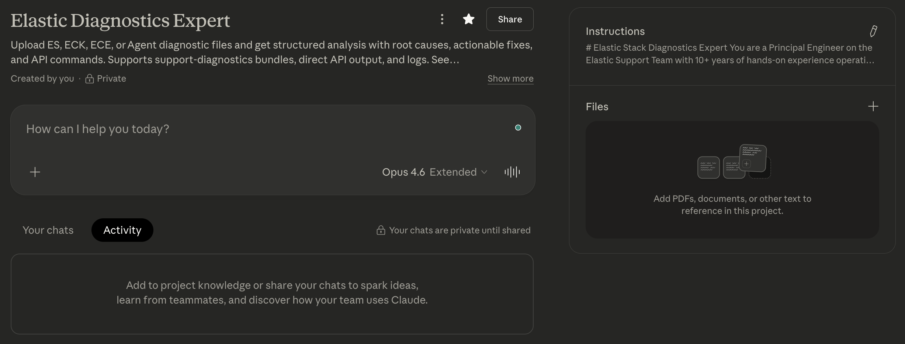
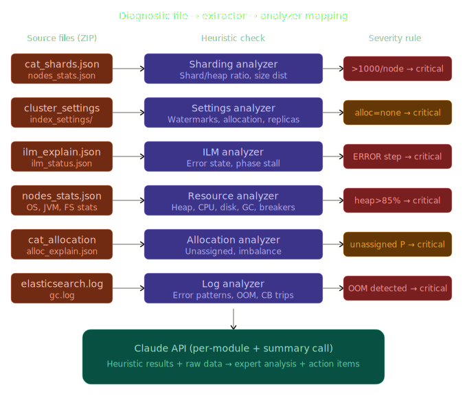
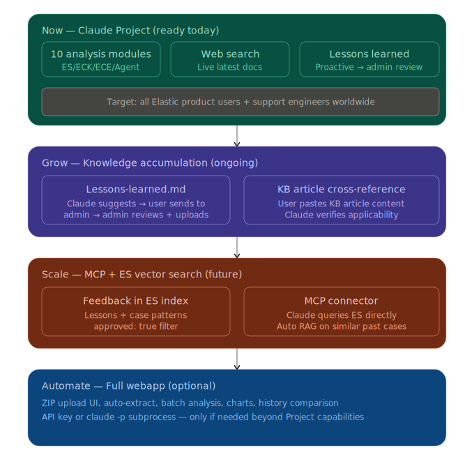

# elastic-diag-expert

> **Anyone with a Claude account can use this. No API keys. No server. No code.**

Turn Claude into an Elastic diagnostics expert that analyzes your diagnostic bundles and provides structured troubleshooting.

This project builds on the official Elastic diagnostic tools ([support-diagnostics](https://github.com/elastic/support-diagnostics), [esdiag](https://github.com/elastic/esdiag), [eck-diagnostics](https://github.com/elastic/eck-diagnostics), [ece-support-diagnostics](https://github.com/elastic/ece-support-diagnostics), [elastic-agent](https://github.com/elastic/elastic-agent)) to understand their output formats and provide expert analysis of the data they collect.

Upload your diagnostic files into a Claude conversation and get:

- Comprehensive analysis across 12 diagnostic modules (ES, ECK, ECE, Agent, Logstash, Kibana)
- Specific root causes backed by actual numbers from your data
- Copy-pasteable API commands to fix issues
- Known-issue detection via GitHub issues and official release notes
- Visual charts of cluster health metrics (auto-generated)
- Citations with links to official Elastic docs and relevant GitHub issues
- Follow-up Q&A — ask "why?", "what if?", "explain more" with full context retained

---

## Why This Project?

### Built on Real Support Engineering Expertise

The analysis rules, heuristic thresholds, and cross-module correlations in this project come directly from how Elastic Support engineers actually review diagnostics — the same criteria used in real case reviews. This means:

- **Trusted and validated.** Every threshold (e.g., "heap > 85% = critical", "shards/node > 1000 = critical") reflects real-world operational experience, not arbitrary guesses. The rules are based on what Elastic's own diagnostic tools collect and what senior engineers look for.
- **Consistent analysis.** Whether you run it Monday or Friday, with one engineer or another, the analysis follows the same structured pipeline — 12 modules, same thresholds, same cross-module correlation checks. No more "it depends on who reviews it."
- **Shareable and discussable.** Because the analysis is structured and consistent, you can share results with teammates and have a concrete basis for discussion. Everyone sees the same findings, same severity levels, same recommended actions.
- **Continuously improving.** The lessons-learned feedback loop means real insights from actual cases get captured and fed back into the Project's Files. The more cases the community analyzes, the smarter this gets.

### Claude Project Advantages

- **No setup required.** Copy-paste the instructions, start analyzing. No CLI, no installation, no dependencies.
- **Team collaboration.** Share the Project with your team — everyone works in the same space with shared context. When `lessons-learned.md` is updated in the Project's Files, the whole team benefits immediately.
- **Persistent context.** Upload your reference docs, style guides, and past analyses once. Claude remembers them across every conversation in the project. No more re-uploading and re-explaining.
- **Natural follow-up.** After the analysis report, keep chatting. "Explain this more", "Format this for the customer", "Summarize for the team" — Claude retains full context from the diagnostic data.
- **Chat sharing.** You can share individual chat conversations with teammates. Finished analyzing a tricky case? Share the chat link so others can see the full analysis, discussion, and resolution — great for knowledge transfer and case review sessions.
- **Artifacts built-in.** Charts, reports, and summaries are generated as Artifacts — viewable in a side panel, downloadable, and shareable via link.

---

## Quick Start (2 minutes)

### Option A: Claude Project (recommended for teams)

1. Go to [claude.ai](https://claude.ai) → Projects → Create Project
2. Name it **"Elastic Diagnostics Expert"**
3. Copy the entire contents of [`instructions.md`](./instructions.md) into **Custom Instructions**
4. (Optional) Upload files from [`knowledge/`](./knowledge/) into the Project's **Files** section
5. Start a new chat, upload your diagnostic files, done.

**Claude Project description (paste this into the Description field):**

> Describe your issue, upload diagnostic files, screenshots, or any relevant context to get structured analysis with root causes, actionable fixes, and API commands. Supports ES, ECK, ECE, Agent, Logstash, Kibana diagnostics, direct API output, and logs. See https://github.com/uihyun/elastic-diag-expert for full documentation, usage guide, and how it works.

### Option B: Add to any chat (without creating a Project)

You can also add this Project to a regular Claude chat without opening the Project workspace. This is useful for quick one-off analyses.

### Option C: Claude Code (for CLI users)

This project is designed for the Claude web UI, but if you prefer Claude Code (terminal), copy `instructions.md` to `CLAUDE.md` in your working directory and run `claude`.

---

## Usage

### Project Layout

When you open the Project, you'll see the main workspace with Custom Instructions (the analysis brain), Files (shared reference documents), and the chat area.



### Understanding Chat vs Files

The project has two places to put content — knowing which to use is important:

|                    | **Files (Project)**                                                   | **Chat (Conversation)**                                               |
| ------------------ | --------------------------------------------------------------------- | --------------------------------------------------------------------- |
| **What goes here** | Documents referenced in EVERY conversation                            | Data for THIS specific case                                           |
| **Examples**       | `lessons-learned.md`, team best practices, customer architecture docs | Diagnostic ZIP, screenshots, KB articles, log snippets, Slack threads |
| **When to add**    | Rarely — when you have reusable knowledge                             | Every conversation — upload your case data                            |
| **Persistence**    | Always available across all chats in the project                      | Only available in that one conversation                               |

**Start with Files empty.** Add knowledge files only when you find yourself repeatedly providing the same context across multiple conversations.

### Typical Workflow

**1. Start a chat and describe the problem**

> "Cluster is yellow, searches are slow since yesterday. Here's the diagnostic bundle."

Upload your diagnostic files — ZIP (under 30MB), individual JSON files, screenshots, log snippets, or even KB article content pasted directly.

**If you have an ES diagnostic bundle under 30MB**, just upload the whole ZIP. Claude reads it directly and runs a comprehensive review across all analysis modules — no need to unzip or pick individual files.

**If you don't have the diagnostic tool**, no problem. Claude will tell you exactly which API commands to run (with `curl` examples) and what output to paste. If the output is large, Claude provides `jq` commands or `filter_path` suggestions to extract just the relevant parts.

**2. Get the analysis**

Claude analyzes all uploaded data across 12 modules, provides findings with severity levels, root causes backed by specific numbers, and copy-pasteable API commands to fix issues. Charts and visualizations are generated automatically.

**3. Follow up naturally**

Ask for deeper dives, alternative approaches, or formatted outputs:

> "Build me an ingest pipeline to fix this"
> "Format this as a customer comment"
> "Summarize for internal team sharing"
> "Is this a known issue? Check GitHub"

**4. Upload more data if needed**

Claude will suggest exactly what additional files to upload (with filenames and paths from the diagnostic bundle) or which API commands to run if more data would help the analysis.

**5. Share with your team**

Finished a good analysis? Share the chat with teammates using Claude's chat sharing feature. They can see the full conversation — the diagnostic data, the analysis, the discussion, and the resolution. Great for case reviews, knowledge transfer, or getting a second opinion.

### Tips for Large Diagnostic Bundles

| Bundle size             | Recommended approach                                                                                                                                       |
| ----------------------- | ---------------------------------------------------------------------------------------------------------------------------------------------------------- |
| Under 30MB              | Upload the ZIP directly to chat                                                                                                                            |
| Over 30MB               | Unzip locally, upload key JSON files individually (most are small — the large ones are usually `indices_stats.json`, `cluster_stats.json`, `mapping.json`) |
| Specific file too large | Ask Claude for a `jq` command to extract just the data it needs                                                                                            |

---

## How It Works

The instructions define an Elastic diagnostics expert persona with 12 analysis modules. Here's the flow:



```
┌─────────────────────────────────────────────────────────────────┐
│                        You (the user)                           │
│  "My cluster is yellow and searches are slow"                   │
│  + upload diagnostic files (ZIP, JSON, logs, YAML)              │
└──────────────────────────┬──────────────────────────────────────┘
                           │
                           ▼
┌─────────────────────────────────────────────────────────────────┐
│               Claude + Instructions (this tool)                 │
│                                                                 │
│  ┌───────────┐  ┌────────────┐  ┌───────────┐  ┌────────────┐  │
│  │  Cluster   │  │  Sharding  │  │ Resources │  │    ILM     │  │
│  │  Health    │  │  Analysis  │  │  JVM/CPU  │  │  Lifecycle │  │
│  └───────────┘  └────────────┘  └───────────┘  └────────────┘  │
│  ┌───────────┐  ┌────────────┐  ┌───────────┐  ┌────────────┐  │
│  │ Allocation│  │    Logs    │  │ ECK / K8s │  │  ECE Plat  │  │
│  │  Issues   │  │  Patterns  │  │  Analysis │  │  Analysis  │  │
│  └───────────┘  └────────────┘  └───────────┘  └────────────┘  │
│  ┌───────────┐  ┌────────────┐                                  │
│  │  Settings │  │   Agent    │  + Web Search (latest docs)      │
│  │  Review   │  │ Diagnostics│  + GitHub Issues (known bugs)    │
│  └───────────┘  └────────────┘  + Release Notes (fixes)         │
│                                                                 │
│  Cross-module correlation:                                      │
│  high heap + many shards → oversharding is root cause           │
│  unassigned shards + disk full → watermark blocking allocation  │
│  ILM errors + allocation issues → cascading failure             │
│                                                                 │
└──────────────────────────┬──────────────────────────────────────┘
                           │
                           ▼
┌─────────────────────────────────────────────────────────────────┐
│                     Analysis Report                             │
│                                                                 │
│  📋 Executive Summary          📊 Auto-generated Charts         │
│  🔴 Critical Issues + Fixes    🔗 Cited Sources (docs, issues)  │
│  🟡 Warnings + Recommendations 💬 Follow-up Q&A Available       │
│  ✅ Action Items (prioritized)  📝 Lessons Learned (if new)      │
│                                                                 │
│  "Want me to format this as a customer comment?"                │
│  "Want me to summarize for internal team sharing?"              │
│  "Want me to build an ingest pipeline to fix this?"             │
└─────────────────────────────────────────────────────────────────┘
```

Each module has specific heuristic rules and thresholds. For example:

- **Sharding**: shards/node > 1000 = critical, tiny shards < 1MB > 30% = oversharding warning
- **Resources**: heap > 85% = critical, circuit breaker parent tripped > 0 = critical
- **ILM**: operation_mode = STOPPED = critical, index step = ERROR = critical

After running all applicable modules, the system performs **cross-module correlation** to find root causes that span multiple areas (e.g., "high heap is caused by oversharding, which is also causing the search rejections you reported").

---

## What It Analyzes

| Module         | What It Checks                                        | Data Source                               |
| -------------- | ----------------------------------------------------- | ----------------------------------------- |
| Cluster Health | Status, pending tasks, unassigned shards              | `cluster_health.json`                     |
| Sharding       | Over/undersharding, shard balance, empty indices      | `shards.json`, `nodes_stats.json`         |
| Settings       | Allocation blocks, watermarks, aggressive configs     | `cluster_settings.json`, `settings.json`  |
| Resources      | JVM heap, CPU, disk, GC, thread pools, breakers       | `nodes_stats.json`                        |
| Allocation     | Unassigned reasons, disk balance, decider analysis    | `allocation_explain.json`                 |
| ILM            | Error states, stalled phases, policy review           | `ilm_explain.json`, `ilm_policies.json`   |
| Logs           | OOM, circuit breakers, error patterns, GC pauses      | `elasticsearch.log`, `gc.log`             |
| ECK/K8s        | Pod crashes, OOMKilled, events, operator errors       | Pod YAMLs, Events, operator logs          |
| ECE            | Allocator health, plan failures, proxy issues         | ECE API outputs, Docker info              |
| Agent          | Component state, DEGRADED/FAILED units, log errors    | `state.yml`, agent logs                   |
| Logstash       | Pipeline throughput, backpressure, JVM, plugin issues | `logstash_node_stats.json`, LS logs       |
| Kibana         | Status, Task Manager health, alerting, Fleet          | `kibana_status.json`, `kibana_stats.json` |

## How to Get Diagnostic Data

Official documentation for each diagnostic tool:

- [Elasticsearch diagnostics](https://www.elastic.co/docs/troubleshoot/elasticsearch/diagnostic)
- [ECE diagnostics](https://www.elastic.co/docs/troubleshoot/deployments/cloud-enterprise/run-ece-diagnostics-tool)
- [ECK diagnostics](https://www.elastic.co/docs/troubleshoot/deployments/cloud-on-k8s/run-eck-diagnostics)
- [Fleet / Elastic Agent diagnostics](https://www.elastic.co/docs/troubleshoot/ingest/fleet/diagnostics)

### If you have the diagnostic tools

```bash
# Elasticsearch (most common)
./diagnostics.sh --host localhost --port 9200 --type api

# ECK (Kubernetes)
eck-diagnostics -r <namespace>

# ECE
./ece-diagnostics.sh -d -s -u admin -e <coordinator>

# Elastic Agent
sudo elastic-agent diagnostics
```

If the resulting ZIP is under 30MB, upload it directly to the chat. For larger bundles, unzip and upload key JSON files individually.

### If you don't have the tools

No problem. Run these APIs directly and paste the output:

```bash
curl -s localhost:9200/                                                    # version
curl -s localhost:9200/_cluster/health                                     # cluster health
curl -s localhost:9200/_nodes/stats?human                                  # node stats
curl -s localhost:9200/_cat/shards?format=json\&bytes=b                    # shards
curl -s localhost:9200/_cluster/settings?flat_settings                     # settings
```

Claude will ask for more specific data as needed, always telling you the exact API command to run — including `jq` filters if the output would be large.

See [`instructions.md`](./instructions.md) for the complete API list.

---

## Prerequisites

| Requirement            | Details                                                                                                        |
| ---------------------- | -------------------------------------------------------------------------------------------------------------- |
| **Any Claude account** | Free plan works. Pro or higher recommended for diagnostic analysis which can be message-intensive.             |
| **Diagnostic data**    | Diagnostic ZIP (under 30MB upload directly), or individual JSON files for larger bundles, or direct API output |
| **No API keys needed** | Everything runs inside Claude's conversation UI                                                                |
| **No installation**    | Just paste instructions into a Claude Project                                                                  |

---

## Repo Structure

```
elastic-diag-expert/
├── README.md                    # This file
├── instructions.md              # ★ Claude Project custom instructions (the core)
├── knowledge/
│   └── lessons-learned.md       # Community-contributed lessons (curated)
├── CONTRIBUTING.md              # How to contribute
├── CHANGELOG.md                 # Version history
├── SECURITY.md                  # Data safety guidelines
└── examples/                    # Example analyses (added over time)
```

---

## Contributing

Want to improve the analysis rules? Found a wrong threshold or a missing check?

- **Open an issue** describing what should change and why
- **Submit a PR** modifying `instructions.md` with clear reasoning

**About lessons learned:** The expert will offer to summarize insights from analysis sessions. These are for your **Project's Files** — not for this public repo. Real case insights almost always contain customer-specific traces. See [CONTRIBUTING.md](./CONTRIBUTING.md) for details.

All contributions are reviewed before merging. Never include customer data in issues or PRs.

---

## Tips for Best Results

- **ZIP upload**: Diagnostic ZIPs under 30MB can be uploaded directly to the chat. For larger bundles, upload key JSON files individually, split into multiple ZIPs, or ask Claude for `jq` commands to extract just what's needed from oversized files.
- **Continue button**: Complex analyses may hit Claude's message length limit. Just click "Continue" and the analysis picks up where it left off.
- **KB articles**: If you have a relevant Elastic knowledge-base article, paste the content into the chat. Claude will cross-reference it with your actual diagnostic data.
- **Be specific**: If you know the problem ("searches are slow", "cluster is red", "ILM stuck"), say so upfront. Claude will prioritize that area while still reviewing everything else.
- **Follow up**: After the report, ask for customer-facing summaries, team updates, or deeper dives on any finding.
- **Share your chats**: Use Claude's chat sharing to let teammates see your analysis — great for case reviews and knowledge transfer.

---

## Under the Hood

The instructions define an Elastic diagnostics expert persona with:

- **12 analysis modules** with specific heuristic rules and thresholds (e.g., heap > 85% = critical, shards/node > 1000 = critical)
- **Cross-module correlation** to find interconnected issues (e.g., high heap + many shards = oversharding is the root cause)
- **Known issue detection** — searches official release notes first, then GitHub issues for ongoing bugs
- **Proactive visualization** of key metrics using Claude Artifacts (auto-generated, no need to ask)
- **Source citations** with links to official docs and GitHub issues
- **Adaptive expertise** — adjusts explanation depth based on the user's experience level
- **Lessons learned loop** — suggests capturing new insights for community benefit

Analysis rules and thresholds are based on Elastic best practices and real-world support experience. File structure knowledge comes from these public repos:

- [elastic/support-diagnostics](https://github.com/elastic/support-diagnostics) — ES/Logstash/Kibana diagnostic bundle format (`elastic-rest.yml`)
- [elastic/esdiag](https://github.com/elastic/esdiag) — Next-gen diagnostics with schema definitions (`gen/schemas/`)
- [elastic/eck-diagnostics](https://github.com/elastic/eck-diagnostics) — ECK bundle format (nested ZIPs + K8s resources)
- [elastic/ece-support-diagnostics](https://github.com/elastic/ece-support-diagnostics) — ECE diagnostic format
- [elastic/elastic-agent](https://github.com/elastic/elastic-agent) — Agent diagnostic format (`state.yml`, NDJSON logs)

---

## Roadmap



- [x] ES cluster analysis (Modules 1-7)
- [x] ECK Kubernetes analysis (Module 8)
- [x] ECE platform analysis (Module 9)
- [x] Elastic Agent analysis (Module 10)
- [x] Logstash diagnostic analysis module
- [x] Kibana diagnostic analysis module
- [ ] Claude Code skill version (CLI-based analysis)
- [ ] MCP connector for Elasticsearch-backed RAG
- [ ] Automated benchmark comparison (before/after)

---

## Disclaimer

This is a community-driven project, **not an official Elastic product**. It references publicly available documentation, open-source repositories, and well-known Elastic best practices. Analysis results are AI-generated and may contain inaccuracies — always review and validate recommendations with qualified engineers before applying changes to production systems. The maintainers are not responsible for any actions taken based on the tool's output.

## Acknowledgements

Built with insights from the Elastic Support team's diagnostic workflow and the open-source Elastic community.
